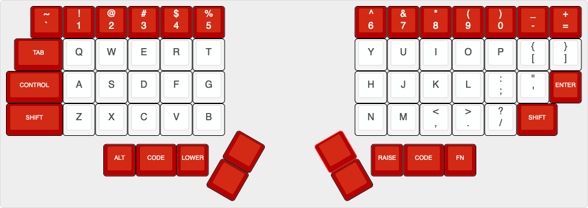

# Overview

A split keyboard with a layout inspired by the [Iris](https://keeb.io/products/iris-keyboard-split-ergonomic-keyboard) and through-hole components inspired by the [plaid](https://github.com/hsgw/plaid). It may or may not be easier to find keycap sets that fit this layout with the correct legends (most base GMK sets should work, with the addition of space keys). It also has a rotary encoder on the right half.

# Key Layout

The key layout looks like this (rotary encoder not included). (Thanks to [Keyboard Layout Editor](http://www.keyboard-layout-editor.com/) for the image.)



This is the corresponding data for pasting into Keyboard Layout Editor:

```
[{x:0.75,c:"#b80000",t:"#f5f5f5",a:5,f:5},"~\n`","!\n1","@\n2","#\n3","$\n4","%\n5",{x:4},"^\n6","&\n7","*\n8","(\n9",")\n0","_\n-","+\n="],
[{x:0.25,a:7,f:2,w:1.5},"TAB",{c:"#f5f5f5",t:"#424242",f:5},"Q","W","E","R","T",{x:4},"Y","U","I","O","P",{a:5},"{\n[","}\n]"],
[{c:"#b80000",t:"#f5f5f5",a:7,f:2,w:1.75},"CONTROL",{c:"#f5f5f5",t:"#424242",f:5},"A","S","D","F","G",{x:4},"H","J","K","L",{a:5},":\n;","\"\n'",{c:"#b80000",t:"#f5f5f5",a:7,f:2},"ENTER"],
[{w:1.75},"SHIFT",{c:"#f5f5f5",t:"#424242",f:5},"Z","X","C","V","B",{x:4},"N","M",{a:5},"<\n,",">\n.","?\n/",{c:"#b80000",t:"#f5f5f5",a:7,f:2,w:1.25},"SHIFT"],
[{y:0.25,x:3},"ALT",{w:1.25},"CODE","LOWER",{x:5},"RAISE",{w:1.25},"CODE","FN"],
[{r:30,rx:6.75,ry:3,y:0.5,x:0.75,f:5},""],
[{x:0.75,f:2},""],
[{r:-30,rx:10.75,y:0.5,x:-1.75,f:5},""],
[{x:-1.75,f:2},""]
```

# PCB Renders

## Left


## Right


# Case/Back Plates

There are no plate or full case files (sandwich style is hard with exposed components...) but there are some DXF files to print back plates for each half. You can mount the PCBs to these back plates using M2 size screws and standoffs. [Here is the file for the left back plate](assets/case-left.dxf) and [here is the file for the right back plate](assets/case-right.dxf).

# Schematic

There is a PDF of the [schematic of the left half here](assets/schematic-left.pdf) and the [schematic of the right half here](assets/schematic-right.pdf). There is a [bill of materials (BOM) here](BOM.md).

# AVR Notes

There will be some notes about programming the microcontroller with [USBaspLoader](https://github.com/baerwolf/USBaspLoader) here. [The ATmega328P datasheet is here](https://ww1.microchip.com/downloads/en/DeviceDoc/Atmel-7810-Automotive-Microcontrollers-ATmega328P_Datasheet.pdf) and [the MC32017 datasheet is here](https://ww1.microchip.com/downloads/en/devicedoc/20001952c.pdf). The keyboard does not use QMK's split keyboard functionality, but extends the number of available I/O pins by communicating with I2C over the TRRS cable. This means it should appear as a single, non-split keyboard to QMK, and has the benefit of requiring fewer components on the right half of the keyboard.

# Sublicenses

* Thank you to [coseyfannitutti](https://github.com/coseyfannitutti) for the footprints `D_DO-35_SOD27_P5.08mm_Horizontal.kicad_mod` and `USB_C_GCT_USB4085.kicad_mod`. [The Creative Commons license for these is included here](LICENSE.CFTKB).
* Thanks to [ai03-2725](https://github.com/ai03-2725) for the `MX*` symbols. [The MIT license for these is included here](LICENSE.ai03).
